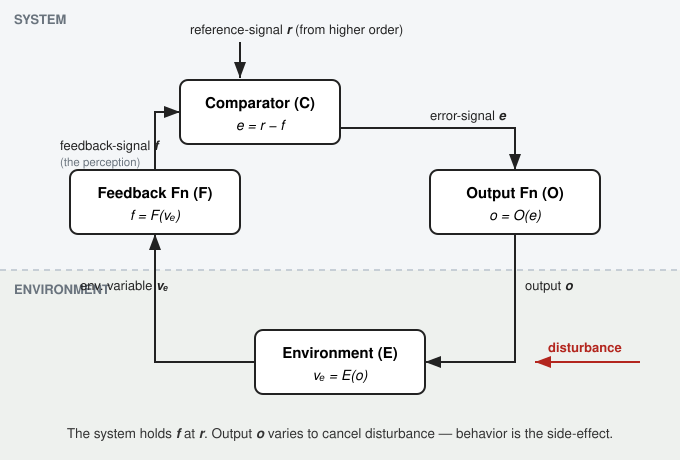

# Behavior: The Control of Perception

*Powers, Clark & McFarland — "A General Feedback Theory of Human Behavior," Parts I & II (1960)*

Two physicists and a clinician spent six years building a control-system model of a person, then went looking in the psychology literature for what they'd built. The paper is the seed of what became Powers' 1973 book and the whole field of Perceptual Control Theory. The title is the thesis, and the thesis is an inversion: **behavior is not the thing the organism controls. Perception is. Behavior is what it does to keep perception where it wants it.**

That sentence sounds backwards the first time, and staying with why it's backwards is the whole chapter.

---

## The thing you can see

Start where an observer starts. You watch a person and you see *output* — an arm swinging, a hand reaching, words coming out. The visible, measurable, recordable stuff is the motion. The instinct of a science of behavior is to treat that motion as the object: stimulus comes in, response comes out, measure the response.

Hold that picture. It's the frame the rest of the paper turns inside out.

## The loop, built from scratch

The authors warn you not to skip the basics even if you know feedback — they cut the loop at non-standard joints and the terms carry the whole later argument. So, the pieces.

A **percept** is the basic unit of experience — the bit of perception that's self-evident, like the intensity of a light or the taste of salt. A **variable** is a percept that can change in magnitude (with a second, unchanging percept tagging its identity). A **function** is a stable relationship among variables, imposed by some physical device — a neural network, a muscle, a chemical reaction. A **system** is a set of functions wired together. Everything else is the **environment**.

Now the control loop itself — three functions inside the system, one in the environment, five variables. Trace it from the input boundary around and back:

- The **Feedback Function** (F) sits at the input boundary. It takes an environmental variable *vₑ* and produces the **feedback-signal** *f* — the system's perception. `f = F(vₑ)`. (Signal = a variable *inside* the system; that distinction is load-bearing.)
- The **Comparator** (C) takes *f* and a **reference-signal** *r*, and subtracts: the **error-signal** is `e = r − f`.
- The **Output Function** (O) turns error into action: `o = O(e) = O(r − f)`.
- The **Environment Function** (E) closes the loop: the output disturbs the world, which changes what F senses. `vₑ = E(o)`.

For this to be a *control* system, every function has to conspire so that any error drives *f* back toward *r* — shrinking the error. **That, exactly, is what negative feedback means.** Not "feedback that's bad," not "a signal that opposes" in some vague sense — feedback whose net effect is to pull the perception toward the reference.

What falls out of this is the move everything hinges on. Disturb the environment — shove the world so *vₑ* would change — and the loop fights you, adjusting *o* until *f* sits back at *r*. The feedback-signal tracks the reference. **The reference-signal is the only handle by which the system can be steered.** Change *r* and the system reorganizes its output to make *f* match. Leave *r* alone and no disturbance you apply will hold, because the output keeps cancelling you out.

## The hinge: output is incidental

Here's the turn.

The system controls *f*. It does not control *o*. Output is whatever it has to be, moment to moment, to keep perception at reference — and in a changing world that means the output is *never the same twice*. The thing an external observer was so confident about — the visible motion — is the one variable in the loop that's allowed to vary wildly. The thing that stays put is the perception, which the observer can't see at all.

Powers states it without flinching:

> The system reacts only to the signals injected into it by its feedback function, and for any one system nothing else exists.

**A control system cannot know what is going on "out there." It knows one thing: its own feedback-signal, and whether that signal is at reference.** Its output produces effects in the real environment "quite incidentally" — side-effects an observer happens to be able to watch. The system isn't trying to produce them. It's trying to make a perception match a goal, and the world-effects are exhaust.

This is why the title reads backwards and is right. Naively: perception causes behavior. Actually: **behavior is the act of controlling perception.** Output exists in the service of holding a perceptual variable at a reference-level, and that's all behavior ever is.

## The hierarchy: perception in orders

One loop holds one perception steady. A person is a stack of them.

The trick is how they stack. A higher system does *not* reach down and move muscles — tie two control systems' outputs together and they fight to a standstill. The only place a higher system can act is the **reference-signal** of the system below. So:

**Every order perceives an environment made entirely of the feedback-signals of the order beneath it, and acts on that environment by setting the references of the order beneath it.** Up the stack you go, and the perceptions get more abstract — further and further from raw sense data. The output of a higher system "is not a muscular force, but a goal toward which lower systems automatically adjust." The higher system specifies *what kind of sensation* the lower one should seek; the lower one figures out the muscle-level details on its own.

The authors worked out six orders, demonstrable on two people and a willingness to get shoved (their "Portable Demonstrator"):

1. **First order — intensity.** The spinal reflex loops. Hold your arm out, have someone shove it down sharply: it springs back as an *active* correction (an electromyograph confirms it's innervated, not just elastic). Proprioception in, muscle force out. Starting position doesn't matter — the reference can be set anywhere.
2. **Second order — sensation.** Sets of first-order signals grouped into elementary sensations (effort, joint angle, a sense of position). Shove the arm mid-swing and the reflexes snap it back *first*, within the latency of the slower second-order system, before the intended motion resumes.
3. **Third order — configuration.** Static arrangements. Reach to touch a target finger; move the target as the hand swings, and after the fast phases a slower corrective creep appears — the configuration system aligning the arrangement of two fingertips.
4. **Fourth order — sequence.** A *sequence* is perceived as an entity, distinct from the static frames it's made of. **You can keep a sequence even as the pieces change** — hum "Shave and a haircut, six bits," or drum it, or tap it out in nine unrelated noises: same sequence, different configurations. Track a finger moving in a circle, then have it stop dead — you keep tracking for nearly half a second, unable to halt the sequence you've set running. The lag is the fourth-order system's slowness, and practice doesn't shorten it.
5. **Fifth order — relationship.** Not the sequence, the *rule among* sequences. Trace a figure-eight, alternating upper (U) and lower (L) loops by a fixed rule — "add one extra L after each U." If the rule produces a never-repeating string, no fourth-order system can learn it (it never repeats), so tracking degrades to jerky third-order — *unless* you perceive the relationship directly, at which point you track smoothly and switch on cue. "Man running" + "another man running" can be *chasing, racing, fleeing, greeting* — all fifth-order readings of the same lower-order pair. Roles, status, communication, interpersonal dynamics all live here.
6. **Sixth order — system.** Organization itself — a personality, a symphony, a government, a self-concept, a mathematical proof. A *fact*, they propose, is a perception that doesn't create a sixth-order error; one that does gets treated as not-yet-true, and you go hunting for the black thread holding up the magician's wand.

Two rules keep the hierarchy honest. **Complexity is not order** — an eleventh-order variable can be *exemplified* by a pile of low-order ones, but it's a self-evidently different kind of perception. And the dependence runs one way: kill the higher perceptions and the lower survive; block the lower and the higher vanish with them.

## Where new systems come from

The model so far reproduces *learned* behavior after learning is done. It can't yet learn, remember, or imagine. Three patches, each load-bearing:

**Reorganization (the N-system).** Beneath the learned hierarchy sits a control system that isn't learned and is running from birth. It monitors **intrinsic signals** — physiological states (the drives, and subtler things like mean error in the hierarchy) — against genetically-fixed reference-levels. When an intrinsic variable drifts off reference, the N-system's output is to *reorganize* — to rewire uncommitted neurons, randomly, into new control systems. **The rate of reorganization is proportional to intrinsic error.** A new arrangement sticks not because anything says "stop," but because it happens to reduce intrinsic error, which slows the reorganizing that would have changed it. Learning is selection by error-reduction, not instruction. Subjectively this is the *aha* — and the authors define **consciousness** as the state of a subsystem's feedback function while the N-system is acting on it.

**Memory and imagination.** A recording function stores feedback-signals and can replay them; the reference-signal a higher system sends is really a *stimulated memory-trace* — a past perception, demanded again in the present. Route that replayed signal into the feedback path instead of the output path and you get **imagination**: planning an action without performing it, dreaming, hallucinating, "filling in" (closure) the small gaps present-time perception leaves. There's a mixing control between full imagination (asleep) and full present-time perception (in danger).

## Back to the observer, frame inverted

Now return to where we started — the person watching behavior — and watch the whole picture flip.

Behavior is **multiordinal**: the same action is describable at many levels, each correct. The authors' question was whether that's an artifact of observation or a real property of the system, and their answer is *both* — because **the observer is a control system too.** Behavior only makes sense to you if you know *which perceptual variable* the behaving system is holding at reference. If someone is controlling a five-times-abstracted variable, you'll see order in their flailing output only if you can build the same abstraction out of your own perceptions.

Which gives an actual method — the **test of the controlled variable** (they call it the test of the significant variable). You don't ask what a system *does*; you guess what it's *holding constant*, then disturb it. Apply every kind of disturbance you can invent. If some variable stays nailed in place against all of them, that's a controlled variable, and the level it sits at is the level it holds. You can read off the reference itself. **Purpose becomes empirical: perturb the world and watch what the system refuses to let you change.**

And the deepest inversion is about control itself. The naive picture says you steer behavior from outside, with rewards and pressure. But a control system, by construction, cancels disturbances — and *you are a disturbance.* Conflict theory makes this sharp: when two higher systems demand contradictory references from a shared lower system, the lower system locks at a **virtual reference level** and looks rigid, immovable, self-defeating. **The system actively holding behavior constant is always one order below where the conflict actually lives.** Force the behavior at that lower level and you fix nothing — the conflict relocates: the paralyzed leg becomes a paralyzed arm, the hatred of father becomes a hatred of money, the compulsive handwashing becomes compulsive bead-telling. Only a change at the order where the systems are fighting does anything permanent.

So:

> To the extent that a person can be controlled by outside agencies, to the frustration of what he originally wanted, he has something wrong with his internal organization... the putative controller is likely to find himself being treated as a disturbing variable in process of being removed.

**You cannot control a control system from the outside. The only control is from within — by what satisfies its own intrinsic state.** "Will power" and authoritarian pressure seldom leave a mark for exactly this reason; push behavior toward the "right" goal and the person's own motivation toward it relaxes while their push the other way climbs, as if they were defending precisely their present state. Which they are.

That's the chiasm closed. We opened with behavior as the visible output an observer measures. We end with behavior as the incidental exhaust of an invisible perception being held at a goal — legible only to an observer who reconstructs the goal, and immovable by any observer who tries to push it from outside. The output was never the point. **The point was always the perception, and behavior is only its control.**

---

*Structure: chiasm. Observed output → the control loop → the hinge (the system perceives only its own feedback-signal; output is incidental) → the hierarchy of perceptual orders → return to the observer with the frame inverted (multiordinality, the test of the controlled variable, control-only-from-within). The title itself is the chiasm in four words.*

*Cut: the full reference table (12 cited works), the boundary-tracing formalism for distinguishing one system from two, the transfer-function / steady-state caveats, the squaring example (`y = x²`) that motivates the imagination connection's wiring, most of the per-order demonstration mechanics, the order-reduction-via-symbols discussion, the detailed taxonomy of conflict resolutions (suppression, defense of the ego), and the closing "statement of values." Preserved: all five loop variables + four functions + their equations, negative feedback as defined, the six orders with one demonstration each, the N-system / reorganization / consciousness definition, memory + imagination, conflict's order-of-origin rule, and the test of the controlled variable.*

*Added (not in source): section heading structure and the bolded load-bearing one-liners.*
